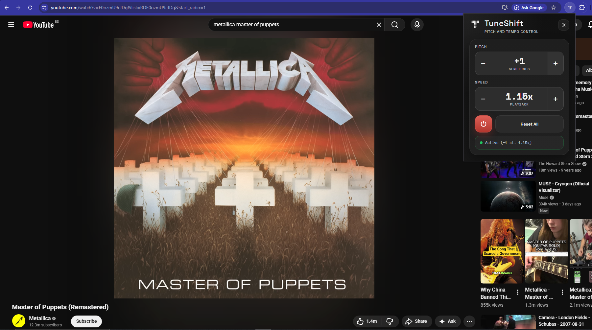
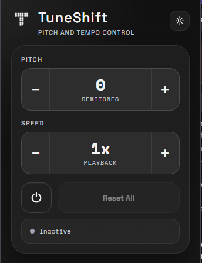
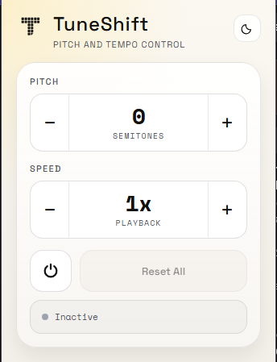

# TuneShift

<p>
  
</p>

TuneShift is a Chrome extension for musicians, vocalists, producers, and practice-heavy listeners who need quick pitch and playback control on YouTube.

It lets you shift YouTube audio by semitones and adjust playback speed from a compact popup, without leaving the video page or reaching for a separate audio tool.

## Preview



| Dark mode | Light mode |
| --- | --- |
|  |  |

## What It Does

- Shift YouTube audio up or down in semitone steps.
- Change playback speed with presets from `0.5x` up to `2x`.
- Keep pitch and playback controls in one focused extension popup.
- Start the audio pipeline automatically when pitch or speed moves away from default.
- Reset pitch and speed back to normal with one button.
- Switch between dark and light popup themes.
- Run only on YouTube pages.

## Why TuneShift Exists

YouTube is one of the easiest places to find songs, lessons, backing tracks, live versions, covers, and practice references. But practicing with YouTube often means the track is in the wrong key, too fast, or too slow.

TuneShift keeps those controls close:

- Transpose a song into your vocal range.
- Practice a solo at a slower speed.
- Match a track to your instrument tuning.
- Speed up or slow down lessons without opening another app.
- Make quick adjustments while the video keeps playing.

## Current Status

TuneShift is available on the Chrome Web Store and can also be loaded manually for development.

The core popup, YouTube content script, background messaging, playback speed controls, semitone state handling, icons, and automated tests are in place. Audio quality and browser behavior can still vary depending on the video, tab state, and Chrome audio pipeline.

## Install

Install from the Chrome Web Store:

[Add TuneShift to Chrome](https://chromewebstore.google.com/detail/tuneshift/ceghljijednkefpinoiilknjfgeffcbl)

## Installation For Development

1. Clone this repository.
2. Open Chrome and go to `chrome://extensions`.
3. Enable `Developer mode`.
4. Click `Load unpacked`.
5. Select the `extension` folder.
6. Open a YouTube video.
7. Click the TuneShift extension icon.

The `extension` folder is the actual Chrome extension root. It contains `manifest.json` directly at the top level.

## Chrome Web Store Packaging

When preparing a store upload, zip the contents of the `extension` folder, not the repository root.

The ZIP should contain files like this at its root:

```text
manifest.json
background.js
content.js
popup.html
popup.js
assets/
lib/
pitch/
```

Do not zip a parent folder that contains `extension/`; Chrome expects `manifest.json` at the ZIP root.

## Permissions

TuneShift keeps permissions intentionally narrow:

```json
"permissions": ["activeTab"],
"host_permissions": ["https://www.youtube.com/*"]
```

These are used so the popup can work with the active YouTube tab and the content script can run on YouTube pages. TuneShift does not request broad access such as bookmarks, context menus, all URLs, storage, or scripting injection permissions.

## Project Structure

```text
extension/
  manifest.json
  background.js
  content.js
  popup.html
  popup.js
  assets/
    fonts/
    icons/
  lib/
    tuneshift-core.js
    tuneshift-audio-engine.js
    tuneshift-stream-source.js
  pitch/
    worklet/

tests/
  background.test.js
  popup.test.js
  tuneshift-audio-engine.test.js
  tuneshift-core.test.js
  tuneshift-stream-source.test.js
```

## Development

The extension does not need a build step. For normal development, edit files in `extension/`, then reload the unpacked extension from `chrome://extensions`.

NPM is only needed if you want to run the automated test suite.

Install test dependencies:

```bash
npm install
```

Run tests:

```bash
npm test
```

Run coverage:

```bash
npm run test:coverage
```

## Tech Notes

- Manifest V3 Chrome extension.
- Popup UI uses plain HTML, CSS, and JavaScript.
- Shared state helpers live in `extension/lib/tuneshift-core.js`.
- Background script owns per-tab extension state.
- Content script connects the popup/background state to the YouTube page.
- Pitch processing is handled through the bundled SoundTouch worklet files.
- Tests run with Vitest and jsdom.

## Limitations

- TuneShift is currently focused on YouTube.
- Real-time pitch shifting can introduce artifacts depending on the source audio and playback settings.
- Some YouTube page transitions may require reopening the popup or refreshing extension state.
- This is not intended to replace a DAW or professional pitch correction workflow.

## License

TuneShift is released under the MIT License.

This project includes third-party SoundTouch license files under `extension/pitch/` and `extension/pitch/worklet/`.

Project license information is available in [LICENSE](LICENSE).
